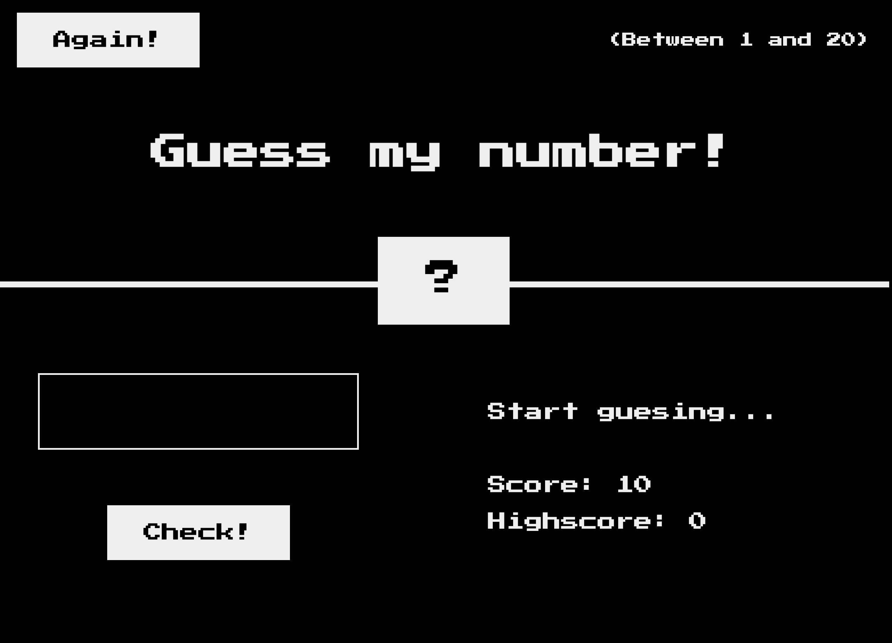

# Game "Guess My Number"

This project is a simple number guessing game implemented using HTML, CSS, and JavaScript. The user must guess a secret number between 1 and 20. The game provides feedback for each guess and tracks the player's current and highest scores.

## Table of Contents

- [Demo](#demo)
- [How to Play](#how-to-play)
- [Features](#features)
- [Technologies Used](#technologies-used)
- [Skills Demonstrated](#skills-demonstrated)

## Demo

## How to Play

1. Enter a number between 1 and 20 in the input field.
2. Click the "Check" button to submit your guess.
3. The game will provide feedback if your guess is too high or too low.
4. If you guess the correct number, the game will congratulate you and display the secret number.
5. Press the "Again" button to reset and play again.

## Features

- Generates a random secret number between 1 and 20.
- Validates user input to ensure it is between 1 and 20.
- Provides feedback if the guess is too high or too low.
- Tracks and displays the current score and high score.
- Responsive UI that provides visual feedback when the player wins.
- Ensures a smooth user experience by disabling inputs and buttons appropriately.

## Technologies Used

- HTML5
- SASS (CSS pre-processor)
- JavaScript (ES6)
- Git (for version control)

## Skills Demonstrated

### HTML

- **Semantic HTML**: Structured the game interface using semantic HTML tags for clarity and accessibility.
- **BEM**: Used BEM methodology for naming CSS classes to improve readability and maintainability.

### SCSS (Sass)

- **Nested Rules**: Utilized nested rules to keep styles organized and maintainable.
- **Variables**: Used SCSS variables for colors and other design constants to ensure consistency and easy theming.
- **Dynamic Styling**: Changed styles dynamically using JavaScript to provide visual feedback.

### JavaScript

- **DOM Manipulation**:
  - Selecting and modifying HTML elements.
- **Event Handling**:
  - Adding event listeners to buttons and the document.
  - Handling user inputs in real-time.
- **Game Logic**:
  - Generating random numbers.
  - Implementing the core game logic to compare guessed numbers with the secret number.
  - Providing feedback to the player.
- **Input Validation**:
  - Ensuring the input field only accepts numeric values between 1 and 20.
  - Clearing the input field for invalid values.
- **State Management**:
  - Keeping track of the game state (current score, high score, secret number).
  - Resetting the game state when the player chooses to play again.
